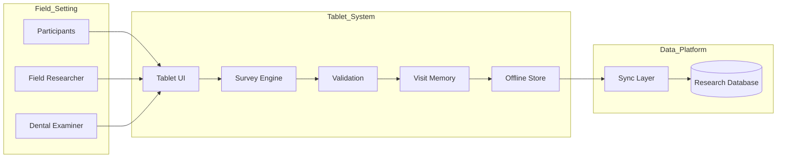
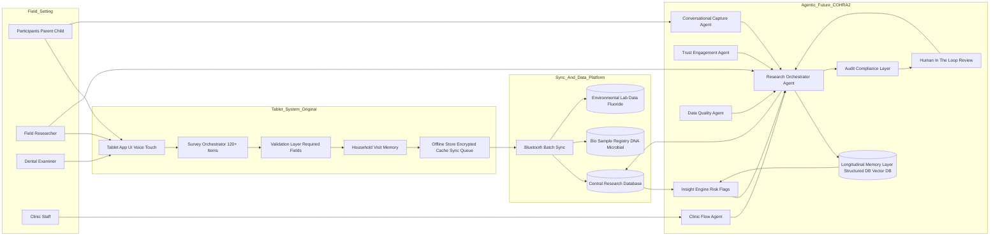

# Field Guide

## From Deterministic Capture to Agentic Orchestration

Field Guide explores how longitudinal health research systems evolve from rigid survey engines into adaptive, agentic infrastructure.

---

## Context

COHRA1 was a 700-household NIH-funded longitudinal study examining oral health disparities across rural Appalachia.

The original system relied on:

- Paper surveys  
- Manual intake workflows  
- Cross-site protocol variance  
- Multi-day data processing  
- Cognitive overload and response degradation  

It captured data.

It did not manage entropy.

---

## Deterministic System (v1)

The first evolution replaced paper with a structured tablet workflow:

- 120+ branching survey questions  
- 3rd-grade reading-level rewrite  
- Offline-first encrypted storage  
- Bluetooth sync to central research database  
- Standardized clinical capture (DMFT)  
- DNA + microbial sample registry  
- Environmental fluoride data linkage  

Participation doubled.  
Completion time dropped 82%.  
Data latency fell from days to hours.  

## Architecture:

## The Limitation

Deterministic systems are static.

They cannot:

- Detect fatigue in real time  
- Adapt phrasing dynamically  
- Reconcile contradictions proactively  
- Monitor trust erosion  
- Coordinate multi-actor flow  

They reduce friction.  
They do not reason.

---

## Agentic Evolution (v2)

This project reimagines Field Guide as a multi-agent orchestration system.

### Core Agents

**Conversational Capture**  
Adaptive phrasing and clarification.

**Trust & Engagement**  
Fatigue and dropout detection.

**Data Quality**  
Real-time anomaly and contradiction checks.

**Clinic Flow**  
Operational coordination across spaces.

**Research Orchestrator**  
Policy enforcement and routing.

**Longitudinal Memory**  
State persistence across years.

---

## Architecture

## What This Demonstrates

- Human-in-the-loop system design  
- Distributed orchestration  
- Offline-first state management  
- Variance reduction as a design goal  
- Agent layering architecture  
- Audit-aware AI infrastructure  

This is not a chatbot.  

It is intelligence infrastructure.

---

## Demo

Launch → *(link here)*

### Features

- Adaptive rephrasing (three reading tiers)  
- Fatigue detection and nudges  
- Contradiction flagging  
- Offline sync simulation  
- Audit trail visualization  

Field Guide evolved from a deterministic survey engine into an agentic research orchestration system.

